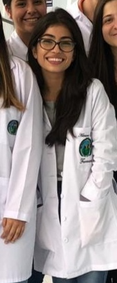

```{r setup, include=FALSE}
knitr::opts_chunk$set(echo = FALSE)
```
{weight=400}
**BIO**

Adriana is a Pharmacy student at the University of Costa Rica and she also has a Middle Technician in Banking and Finance. She is currently collaborating in the project *"Antimicrobial Peptides as future antibiotics: Physicochemical Characterization by Computational Methods of their Bioactive Structures determined by Nuclear Magnetic Resonance in Membrane Environments"*, performing the structural analysis of the polarity of antimicrobial peptides extracted from plants such as *Nicotiana alata*, *Eucommia ulmoides* and *Solanum tuberosum*. Thanks to this project I have acquired various skills in performing chemoinformatic analysis, which are essential for the development of future antibiotics that will be an imminent need in the future. 

In addition to chemistry, I have a passionate preference for languages and music.


