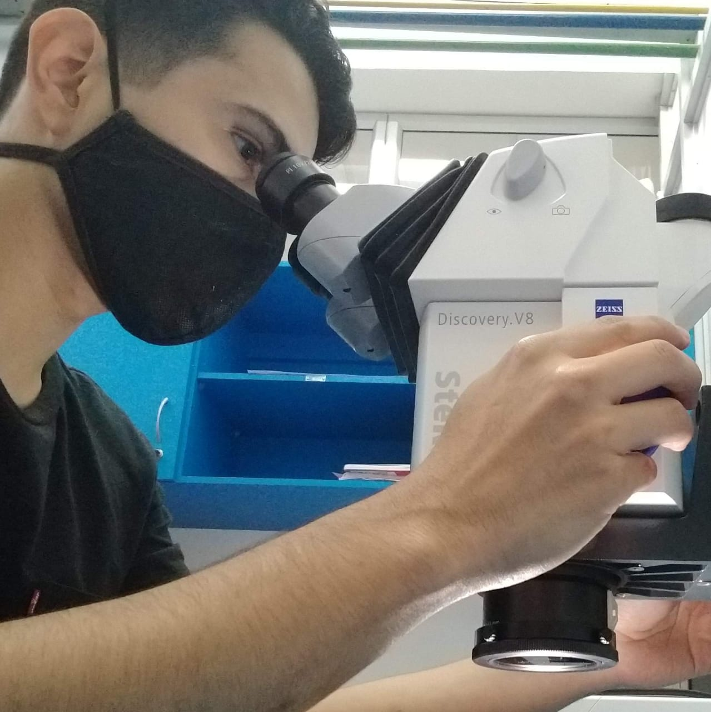

```{r setup, include=FALSE}
knitr::opts_chunk$set(echo = FALSE)
```
Welcome Allan!



**BIO**

Allan joined Dr. Soto Tellini's group in the fall of 2018, where he has learned about organic synthesis techniques. In 2020 Allan earned his bachelor's degree in Chemistry, and then he enrolled in the M. Sc. Program. His thesis's goal is the synthesis of bile acids derivates for increasing solar cell efficiency. Additionally, Allan has studied the crystal and supramolecular arrangements and antimicrobial properties of bile acids derivates. In the CBio3 group, Allan is working in conformational studies of bile acids derivates.


