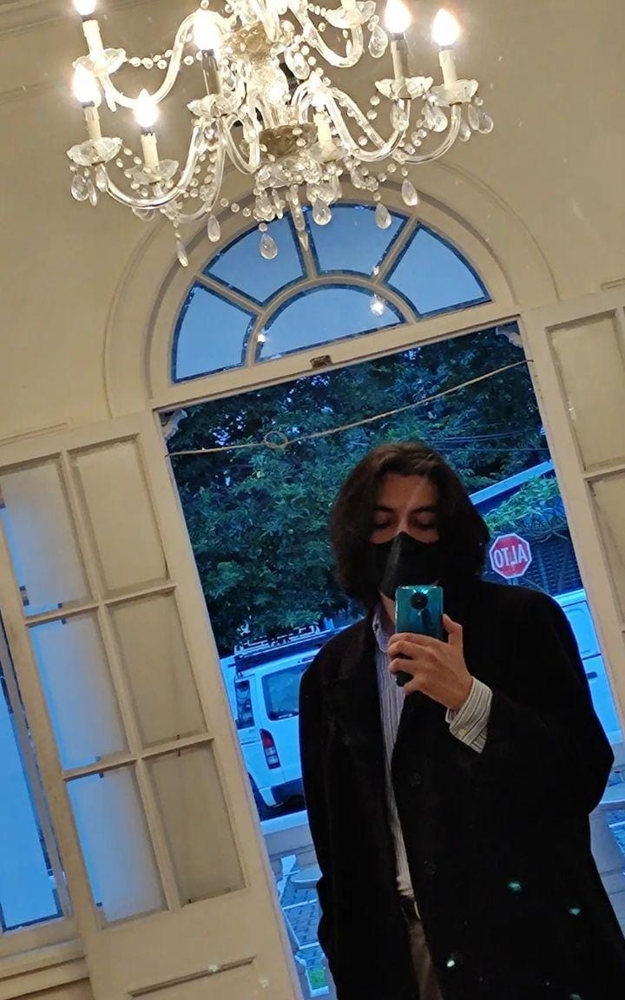

```{r setup, include=FALSE}
knitr::opts_chunk$set(echo = FALSE)
```

**BIO**

Daniel is a last year Chemistry student at the UCR. He joined the CBIO3 Group at the beginning of 2023, and has been in charge of the NAtural PROducts REpository - Costa Rica (**NAPRORE-CR**) to make an inventory of the wealth of isolated and identified natural products in Costa Rica. This database is aimed to serve as a valuable resource for research and discovery of potential new drugs and to increase the accesibility of the information for new investigations focused on the compounds found in the country's rich biodiversity. NAPRORE-CR will be a part of the Latin American Natural Product Database (LANaPD), an unified resource that will encompass the efforts of multiple countries across the continent to create a collection of relevant information such as structure, sources and bioactivity of the compounds obtained in the region. 

Besides his work in the group, Daniel is interested in inorganic chemistry, nanomaterials, innovation, science communication and education. Outside of his studies, he enjoys hanging out with friends and family, playing video games, competing in and spectating sports tournaments, hiking, playing basketball, going to concerts and spending time with his dog and all kinds of animals in general.

**PRIZES AND AWARDS**

In the second half of 2022, Daniel participated in the Entrepreneurship, Development and Innovation Fair (FEDI) of the School of Chemistry of the University of Costa Rica. He and his team developed a prototype of a commercial low-calorie, effervescent powdered drink made with freeze-dried dragonfruit and passionfruit. The project, called 'Lyphy', obtained the bronze medal in the competition.

In 2021, he participated in UInnova, an inter-institutional innovation challenge organised by the National Council of Rectors (CONARE) and the five state universities of the country. Daniel was part of "7 CHAKRAS" team, which proposed a solution to increase mobility and autonomy of people with visual impairments in work environments using Wi-Fi positioning systems, NFC technology and other implementations. "7 CHAKRAS" was awarded first place in the challenge.

In 2019, he received an award as the best annual weighted average score of the School of Chemistry.

In 2017, he obtained the highest admission score at the Technological Institute of Costa Rica (ITCR) and the twenty-fourth highest admission score at UCR.

In addition to the previous achievements, Daniel has obtained several medals in the country's science olympiads: silver in the intermediate category of the XVI Costa Rican Chemistry Olympiad in 2016; silver in the Cadet category of the Canguro Matemático Competition in the 2014 and 2013 editions, gold in the Benjamin category of the 2012 edition; silver in the Level I category of the XXV Costa Rican Mathematics Olympiad in 2013.

