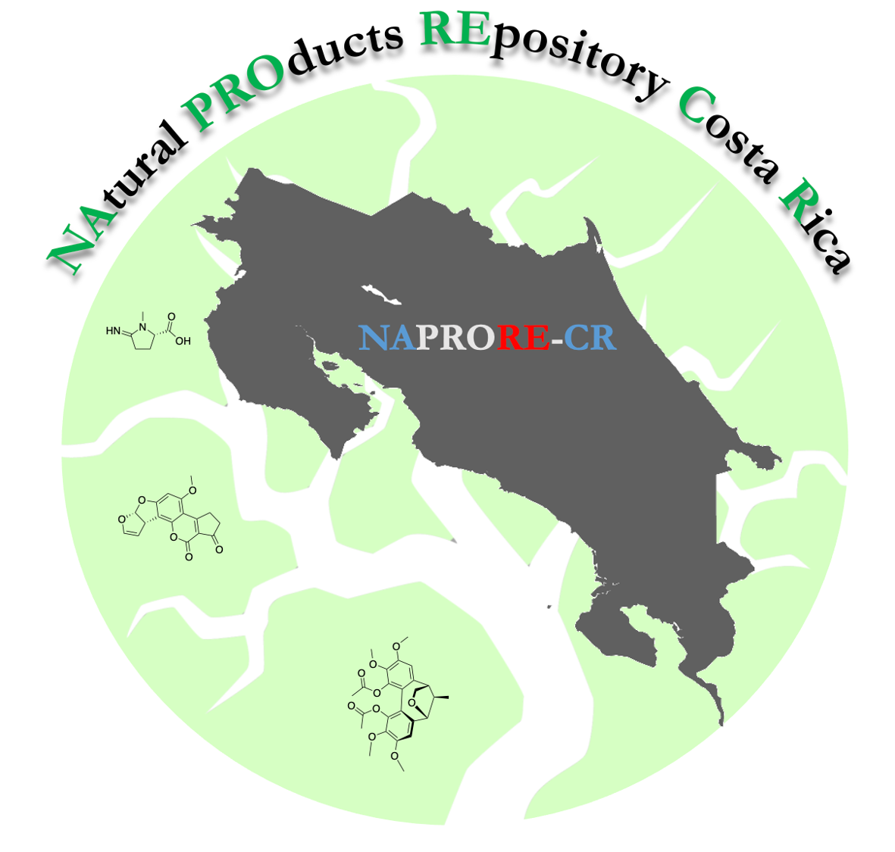
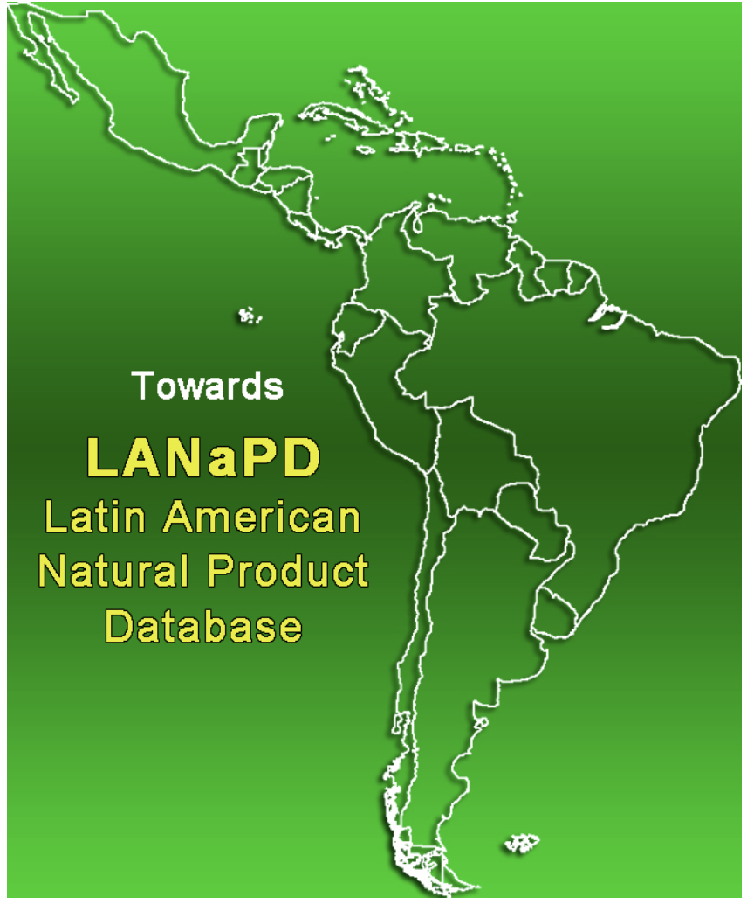

```{r setup, include=FALSE}
knitr::opts_chunk$set(echo = FALSE)
```
<span style="color: blue;">
**1. NAtural PROducts REpository - Costa Rica (available soon)**
</span>


**Costa Rica** is one of the countries with the greatest biodiversity in the world, thus **NAPRORE-CR** was born as a need to make an inventory of the wealth of isolated and identified natural products in Costa Rica.

Within the aims of this repository:

1. Create an open access repository where natural products isolated and identified in Costa Rica can be found.

2. Characterize the chemical diversity of the compounds in the database using chemoinformatic tools and thus be able to serve as a reference source for the design of new drugs and biomaterials.

2. Be part of and contribute to the **Latin American Natural Product Database (LANaPD)**

**NAPRORE-CR** was designed and developed in collaboration with the research group of Dr. Jose Medina-Franco from the UNAM. We will shortly release more details about the database in a publication.

The database will be part of the Latin American Natural Product Database (LANaPD)

<span style="color: blue;">
**2. Distribution Coefficients Databases (available soon)**
</span>

Databases of partition and distribution coefficients determined experimentally. 
