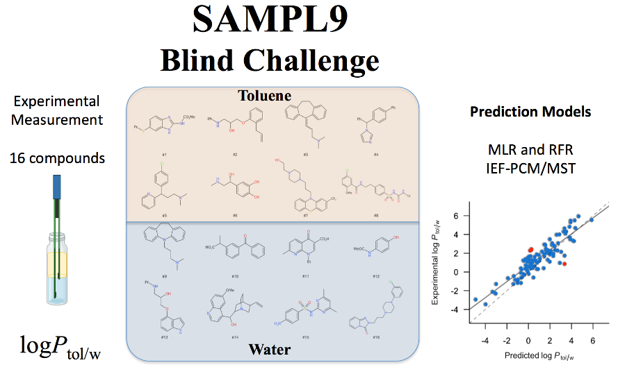

```{r setup, include=FALSE}
knitr::opts_chunk$set(echo = FALSE)
```
<span style="color: #104E8B;">
**1. NAtural PROducts REpository - Costa Rica**
</span>


**Costa Rica** is one of the countries with the greatest biodiversity in the world, thus **NAPRORE-CR** was born as a need to make an inventory of the wealth of isolated and identified natural products in Costa Rica.

Within the aims of this repository:

1. Create an open access repository where natural products isolated and identified in Costa Rica can be found.

2. Characterize the chemical diversity of the compounds in the database using chemoinformatic tools and thus be able to serve as a reference source for the design of new drugs and biomaterials.

2. Be part of and contribute to the **Latin American Natural Product Database (LANaPD)**

**<span style="color: blue;">[NAPRORE-CR](https://doi.org/10.5281/zenodo.7858102)**</span> is being designed and developed in collaboration with the research group of Dr. Jose Medina-Franco at UNAM. 

Cite as Zamora, William J., Pinheiro, Silvana, & Acuña, Daniel. **(2023)**. NAPRORE-CR (NAtural PROducts REpository - Costa Rica) (Version v2) [Data set]. Zenodo. https://doi.org/10.5281/zenodo.7858102

The database will be part of the Latin American Natural Product Database (<span style="color: blue;"> **[LANaPD](https://www.future-science.com/doi/10.2144/fsoa-2020-0068)**</span>)


<span style="color: #104E8B;">
**2. Toluene/Water Partition Coefficient Database**
</span>

In recent years the use of partition systems other than the widely used biphasic n-octanol/water has received increased attention to gain insight into the molecular features that dictate the lipophilicity of compounds. Thus, the difference between n-octanol/water and toluene/water partition coefficients has proven to be a valuable descriptor to study the propensity of molecules to form intramolecular hydrogen bonds and exhibit chameleon-like properties that modulate solubility and permeability. In this context, **<span style="color: blue;">[Toluene Database](https://doi.org/10.5281/zenodo.7884699)</span>** is a dataset of 252 unique molecules with experimentally determined toluene/water partition coefficient is deposited here. 

Cite as William J. Zamora, Silvana Pinheiro, Antonio Viayna, Carles Curutchet, Laia Bisbal, Rebeca Ruiz, Clara Ràfols, & F. Javier Luque. (2023). Toluene/Water Partition Coefficient Database (Version v1) [Data set]. Zenodo. https://doi.org/10.5281/zenodo.7884699


