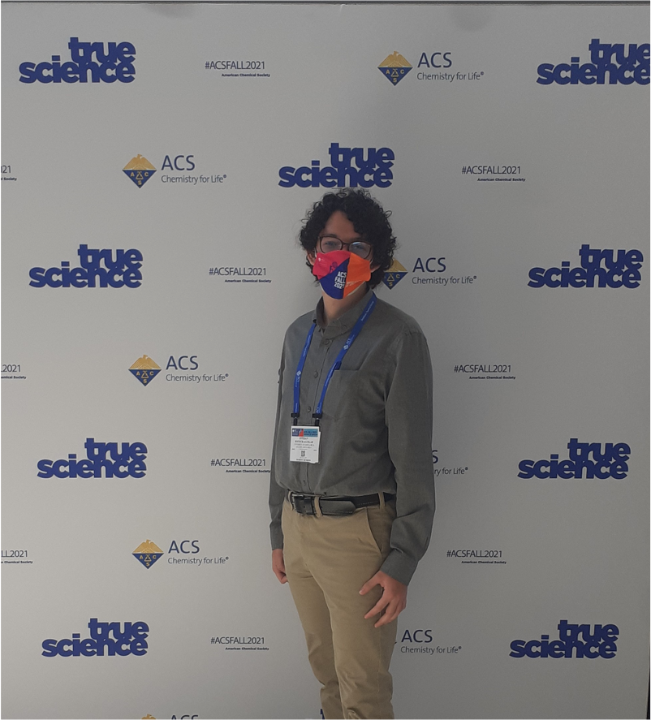

```{r setup, include=FALSE}
knitr::opts_chunk$set(echo = FALSE)
```

**BIO**

Esteban has been part of the CBIO3 Group since the beginning of 2021. His current research project is carried out with his collegues Sebastián Suñer and Kenneth López, under the guidance of Dr. William Zamora.

Their current project consists of investigating the influence of ion formation on the lipophilicity of some small organic molecules. In short, organic molecules that have acidic (carboxylates, amides, etc.) or basic (amines, phosphines, pyridines, etc.) functional groups will exist in an equilibrium between their neutral species and their ionic form. So, they set out to answer whether considering these chemical equilibriums improve lipophilicity prediction calculations. In addition, they dedicate to answer questions such as: Do these considerations work better for acids? Or for bases? What happens if a molecule has both acidic and basic groups at the same time? Are the predictions still good at different pHs?, among other.

In addition, he also collaborates in projects dedicated to the application of Machine Learning to determine new lipophilicity descriptors of small molecules in collaboration with the University of Barcelona and the Pharmaceutical Development and Technology Company | Pion from the UK.

Currently, Esteban is doing a professional internship at the Electrochemical and Chemical Energy Research Center at the University of Costa Rica (CELEQ).

In addition to studying: Esteban likes to do any kind of sport. He mentions that he is mediocre good at mixed martial arts, soccer, basketball, tennis, volleyball, among others. Esteban really like to dance, hang out with his girlfriend, go out with friends, play videogames, watch anime, YouTube, Twitch, etc.


**PRIZES AND AWARDS**

1) During 2020 and 2021, Esteban participated as a teaching assistant in introductory laboratory courses for Chemistry students. The pandemic suddenly forced them to plan remote activities. Their initial results are reported in the Journal of Chemical Education: <https://dx.doi.org/10.1021/acs.jchemed.0c00803>.

2) Onto the next semenster, one of the experiments they designed was presented as a poster during the virtual conference of the ACS Spring National Meeting 2021 and at the 44th Senior Technical Meeting of ACS Puerto Rico: <https://doi.org/10.1021/scimeetings.1c00747>. It consisted on a household titration of vinegar with sodium bicarbonate with minimal equipment. Semi-quantitative results can be achieved, as well as tons of valuable educational goals for Chemistry freshmen.

3) During the second half of 2021, Esteban participated with my colleagues David Pacheco and Ariel Fernández in the Entrepreneurship and Innovation Fair (FEDI) of the School of Chemistry of the University of Costa Rica. We created the company PROJECT SAFE. During the semester, we dedicated ourselves to designing our POLARIS product. This prototype facilitates the detection of adulterated beverages on the spot inside bars or parties. The prototypes can be found in this website: <https://view.genial.ly/616e1a688a57760d68f41f4d/presentation-fedi-2021?fbclid=IwAR0iVl91f_3moIbDhp9da5uwn_RylpROkV3lHwARcXsn8ZZTbKoyjqGm8qI>
