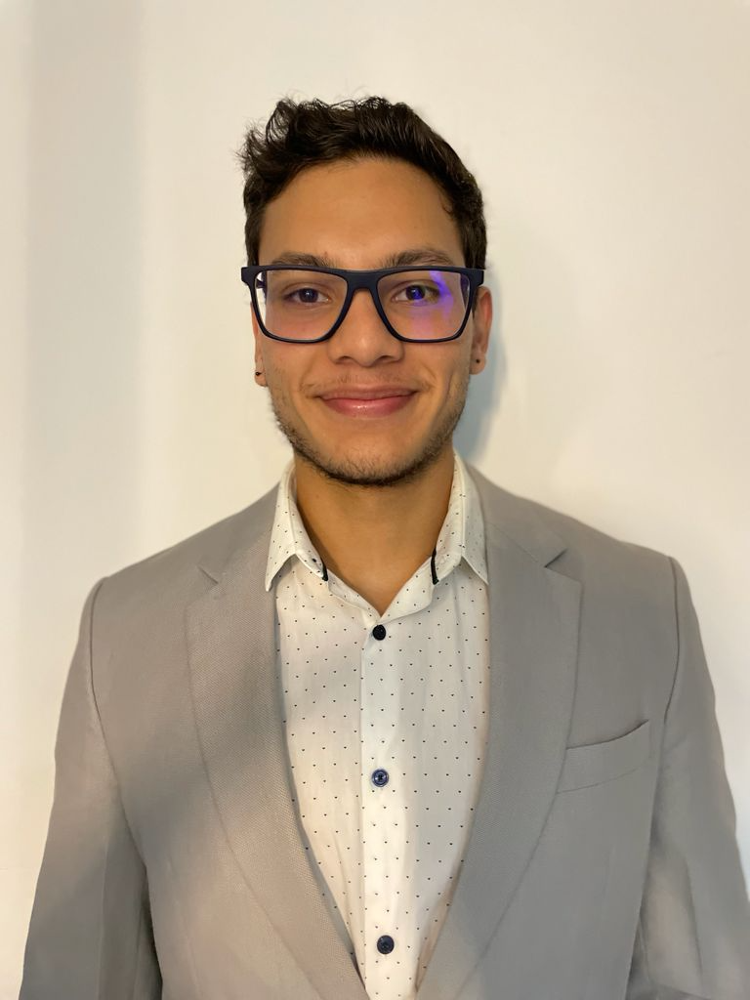
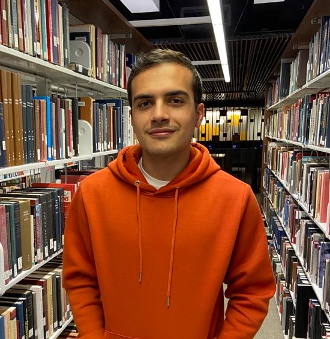

```{r setup, include=FALSE}
knitr::opts_chunk$set(echo = FALSE)
```


**Eduardo** left the group in October 2022 and is now doing his PhD at the University of Nottingham at the GlaxoSmithKline (GSK) Carbon Neutral Laboratories for Sustainable Chemistry in the application of machine learning models in organic synthesis



**Kenneth** left the group in August 2022 and is now completing his Ph.D. at the University of Florida in the use of artificial intelligence for chemical similarity search algorithms.


