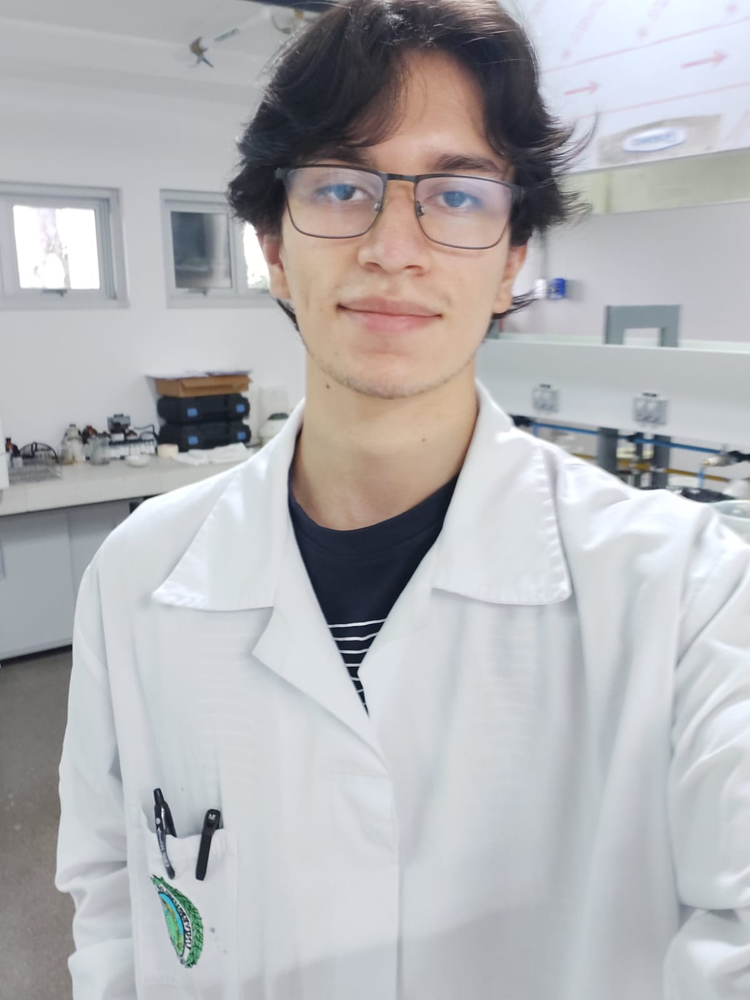

```{r setup, include=FALSE}
knitr::opts_chunk$set(echo = FALSE)
```

**BIO**

Jose Rodríguez Zúñiga is a Chemistry student at the University of Costa Rica. He is currently collaborating in the International Research Project of the CBio3 group called *"Antimicrobial Peptides as Future Antibiotics: Physicochemical Characterization by Computational Methods of their Bioactive Structures Determined by Nuclear Magnetic Resonance in Membrane Environments"* in which, together with my colleague, Adriana, have contributed to the construction of a database of antimicrobial peptides where information on these is collected, such as activity against certain microorganisms, cytotoxicity, PDB code, among others. 
On the other hand, I have been in charge of executing the codes made by the leader researcher (Prof. William Zamora) for each of the peptides that contain cystines or disulfide bonds in their structure. The foregoing, with the aim of analyzing the role of these arrangements in the bioactive capacity of peptides. Some of the achievements throughout his participation in the project have been the opportunity to learn how scientific research is carried out, to strengthen my ability to work in a team, especially in an interdisciplinary environment, and to have the opportunity to make a first contact with chemoinformatics or bioinformatics. 

In addition to studying and collaborating in the group learning new things, it is worth mentioning that I am a person interested in molecular biology and electrochemistry. 

Outside the academic field, I enjoy hiking, reading about social, astronomical, historical, and fictional topics, among others, and crocheting.


