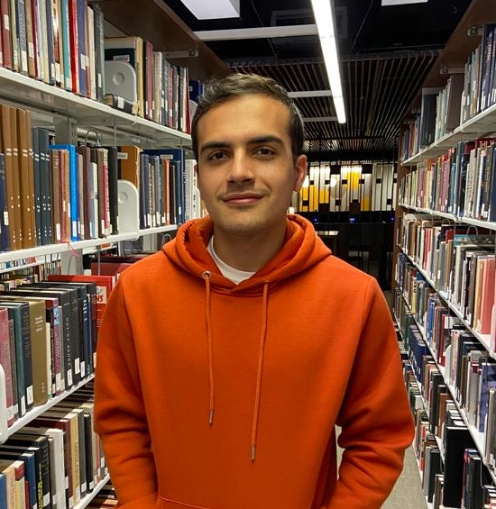

```{r setup, include=FALSE}
knitr::opts_chunk$set(echo = FALSE)
```

**BIO**

Kenneth López Pérez, has a Bachelor's degree in Chemistry and is currently pursuing a graduate degree in Chemistry. His interests are in the application of data science and artificial intelligence to chemistry. 

In 2020, together with Dr. Zamora, they obtained an outstanding participation in the SAMPL7 (international competition for computational drug design), where they developed a model for the prediction of the partition coefficient of sulfonamides. His final graduation project aims to predict the water/n-octanol partition coefficient at different pH with Machine Learning algorithms for monoprotic and monobasic molecules. 
In addition, he is a professor in the General Chemistry Section of the School of Chemistry of the University of Costa Rica. In fall 2022, Kenneth plans to begin his doctoral studies at the University of Florida.

**PRIZES AND AWARDS**

1) One of the first Latin American to obtain an outstanding participation in the 2021 The SAMPL7 Physical Property Challenge. Drug Design and Resource Data, University of California San Diego, United States: *"The Most Exact in Silico Method for the Determination of Lipophilicity in the SAMPL7 Global Challenge"* 
  <https://link.springer.com/article/10.1007/s10822-021-00397-3>

2) Research fellowship of CeNAT/CONARE (2021).

3) Selected expositor for the Golf Coast Undergraduate Research Symposium 2021 at Rice University

4) Selected participant in July 2022 at the American Chemical Society's Lasting Encounters between Aspiring and Distinguished Scientists, an event in which he was selected from hundreds of scientists. international. 

5) Selected in 2021 for the Global Undergraduate Exchange Program Scholarship (United States Embassy) to study at the University of Arkansas for one semester.


