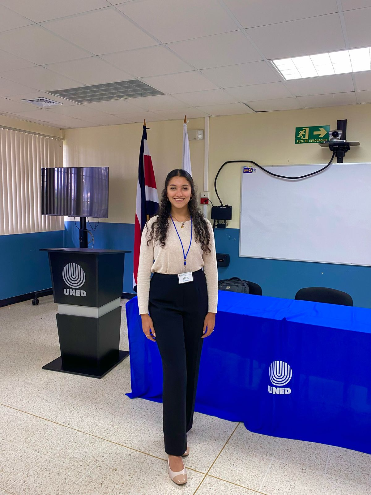

```{r setup, include=FALSE}
knitr::opts_chunk$set(echo = FALSE)
```

**BIO**

Paulina is studying Chemical Engineering at the UCR. She currently collaborates on topics related to the prediction of physicochemical properties of bile acids, non-standard residues of amino acids and in projects related to antimicrobial peptides.


