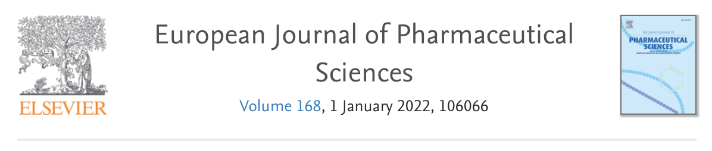
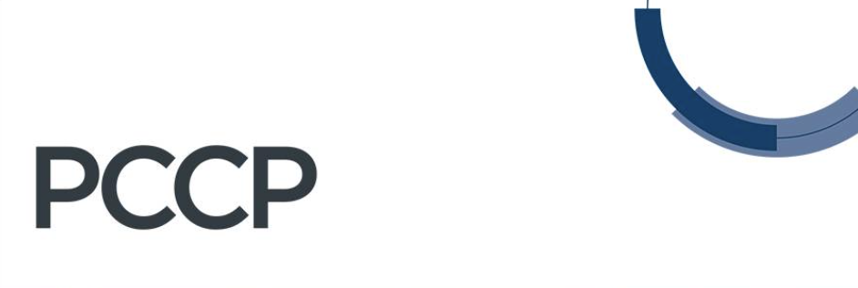
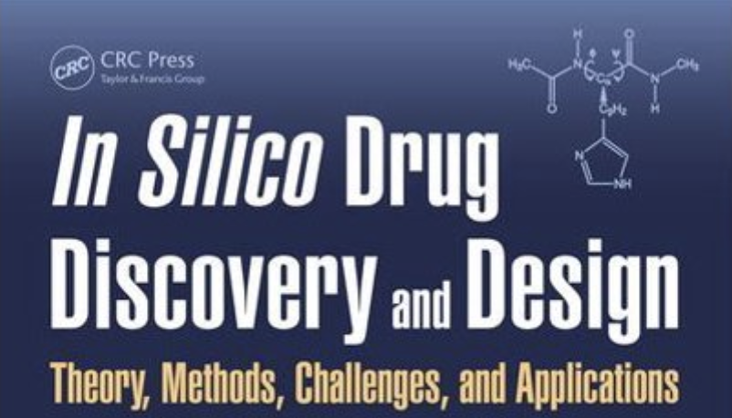

```{r setup, include=FALSE}
knitr::opts_chunk$set(echo = FALSE)
```
```{r layout="l-body"}

```
1. Araya-Sibaja, A; Fandaruff, C; Guevara-Camargo, A; Vargas Huertas, L; Zamora, W; Vega-Baudrit, J; Guillén-Girón, T; Navarro, Mi; Paoli, P; Rossi, P; Jones, W. **(2022)**. Crystal forms of the antihypertensive drug irbesartan: a crystallographic, spectroscopic and Hirshfeld surface analysis investigation. ACS Omega. *Accepted*

```{r layout="l-body"}

```
2. Zamora, W: Ruiz, R;  Elisabeth Bosch, E;,Clara Ràfols, C. **(2022)**. Molecular characteristics of several drugs evaluated from solvent/water partition measurements: Solvation parameters and Intramolecular hydrogen bond indicator.  European Journal of Pharmaceutical Sciences. 168, 106066.
  <https://doi.org/10.1016/j.ejps.2021.106066>
  
```{r layout="l-body"}

```
3. Araújo, J.; Pinheiro, S.; Zamora, W.; Nahum, C.; Lameida, J.; Lima, A. **(2021)**. Structural and Energetic Analysis of SARS-CoV-2 Non-Structural Protein 9 (NSP9). Scientific Reports. 26;11(1):23003
  <https://www.nature.com/articles/s41598-021-02366-0>
  
```{r layout="l-body"}

```
4. Lopez, K.; Pinheiro, S.; Zamora, W. **(2021)**. Multiple linear regression models for predicting the n octanol/water partition coefficients in the SAMPL7 blind challenge. J Comput Aided Mol Des.;35(8):923-931
 <https://link.springer.com/article/10.1007%2Fs10822-021-00409-2>

5. Viayna, A.; Pinheiro, S.; Curutchet, C.; Luque, F.  Zamora, W. **(2021)**. Prediction of n-octanol/water partition coefficients and acidity constants (pKa) in the SAMPL7 blind challenge with the IEFPCM-MST model. J Comput Aided Mol Des.;35(7):803-811
 <https://link.springer.com/article/10.1007%2Fs10822-021-00394-6>

6. Zamora, W.; Pinheiro, S.; German, K.; Rafols, C.; Curutchet, C.; Luque, F. **(2020)**. Prediction of the n-Octanol/Water Partition Coefficients in the SAMPL6 Challenge from MST Continuum Solvation Calculations. J. Comput. Aided Mol. Des. 34(4):443-451.
 <https://link.springer.com/article/10.1007/s10822-019-00262-4.> 

```{r layout="l-body"}

```
7. Zamora,W; Pinheiro,S.; Separovic,F.; and F. J. Luque. **(2020)**. Insights into the Effect of the Membrane Environment on the Three-dimensional Structure-function Relationship of Antimicrobial Peptides, Biophysical Journal 118(3),
Supplement 1, 236A.
 <https://doi.org/10.1016/j.bpj.2019.11.1394>

```{r layout="l-body"}

```
8. Zamora, W.; Campanera, J. M.; Luque F.J. **(2019)**. Development of Environment-Adapted Lipophilicity Scale of Amino Acids from MST Continuum Solvation Calculations. J. Phys. Chem. Lett. 10, 883−889.  1<https://pubs.acs.org/doi/10.1021/acs.jpclett.9b00028>

```{r layout="l-body"}

```
9. Zamora, W.; Curutchet, C.; Campanera, J.; Luque, F. **(2017)**. Prediction of pH-dependent Hydrophobic Profiles of Small Molecules from MST Continuum Solvation Calculations. J. Phys. Chem. B. 121, 9868-9880. Special Issue: “Manuel Yáñez and Otilia Mó Festschrift “
 <https://pubs.acs.org/doi/10.1021/acs.jpcb.7b08311>

```{r layout="l-body"}

```
10. S. Pinheiro, I. Soteras, J. L. Gelpí, F. Dehez, C. Chipot, F. J. Luque and C. Curutchet. **(2017)**.Structural and energetic study of cation–π–cation interactions in proteins, Phys. Chem. Chem. Phys, 19(15), 9849-9861.
 <https://pubs.rsc.org/en/content/articlelanding/2017/cp/c6cp08448f>

```{r layout="l-body"}

```
11. S. Pinheiro and C. Curutchet. **(2017)**. Can Förster Theory Describe Stereoselective Energy Transfer Dynamics in a Protein–Ligand Complex? J. Phys. Chem. B, 121(10), 2265–2278.
 <https://pubs.acs.org/doi/10.1021/acs.jpcb.7b00217>

```{r layout="l-body"}

```
12. Navarro, M. H., Zamora, W., Quesada S. Azofeifa, G., Alvarado, D., Monagas, M. **(2017)**. Fractioning of Proanthocyanidins from U. tomentosa. Composition and Structure-Bioactivity Correlation. Antioxidants, 6(3), 60. Special Issue: "Bioactive Phenolic Compounds". 
 <https://www.mdpi.com/2076-3921/6/3/60>

13. Navarro, M.; Moreira, I.; Arnáez, E., Murillo, R.; Rivera, W.; Zamora, W.; Saravia, A.; Vargas, F. **(2017)**. Preliminar Study on Poliphenolic Contents and Antioxidant Capacity of Malus domestica cultivated in Costa Rica. Tecnología en Marcha. 30, 4-13.
 <https://www.scielo.sa.cr/scielo.php?pid=S0379-39822017000100003&script=sci_abstract&tlng=en>

```{r layout="l-body"}

```
14. Zamora, W.; Campanera, J. M.; Luque F.J. **(2015)**. A new hydrophobicity scale of amino acids based on IEF-MST calculated log PN and log D. Protein Sci. 24, 256-258. Special Issue: “The 29th Annual Symposium of the Protein Society”

```{r layout="l-body"}

```
15. Hoyos, M. N., Sánchez-Patán, F., Masis, R., Martín-Álvarez, P. J., Zamora, W., Monagas, M. J., & Bartolomé, B. **(2015)**. Phenolic Assesment of Uncaria tomentosa L. (cat's claw): Leaves, Stem, Bark and Wood Extracts. Molecules. 20(12), 22703-22717. Special Issue: “Recent Advances in Plant Phenolics”     
 <https://www.mdpi.com/1420-3049/20/12/19875>

```{r layout="l-body"}

```
16. Zamora, W. Campanera, J. Luque, F. **(2015)** Implicit Solvation Methods in the Study of Ligand-Protein Interactions. In C. Cavasotto (Ed.), In silico Drug Discovery and Design: Theory, Methods, Challenges, and Applications. by CRC Press.              <https://www.taylorfrancis.com/chapters/edit/10.1201/b18799-14/implicit-solvation-methods-study-ligand%E2%80%93protein-interactions-william-zamora-josep-campanera-javier-luque>

17. Moreira-González, I. Arnáez-Serrano, E. Murillo-Masís, R. Quesada-Mora, S. Castro-Araya, V. Zamora, W. Cordero-Hernández, M. Loaiza-Cárdenas, J. Navarro-Hoyos, M. **(2014)**. Study of four plants with traditional medicinal use from Costa Rica’s Huetar Norte and Huetar Atlantica regions. Tecnología en Marcha. 27, 69-77. 

18. Navarro-Hoyos, M. Moreira-González, I. Arnáez-Serrano, E. Murillo-Masís, R. Quesada-Mora, S. Zamora, W. Cordero-Hernández, M. **(2014)**. Preliminar Study on Bioactive Potential of Annona cherimola (anona) and Prunus domestica (ciruelo) Cultivated in Costa Rica. Tecnología en Marcha, VI Encuentro de Investigación y Extensión, 37-44.

19. Zamora, W. & Fernández, B. **(2010)**. ®Antología. Actualización sobre el enlace químico y sus consecuencias. Ministerio de Educación Pública. Instituto de Desarrollo Profesional Uladislao Gámez Solano.


