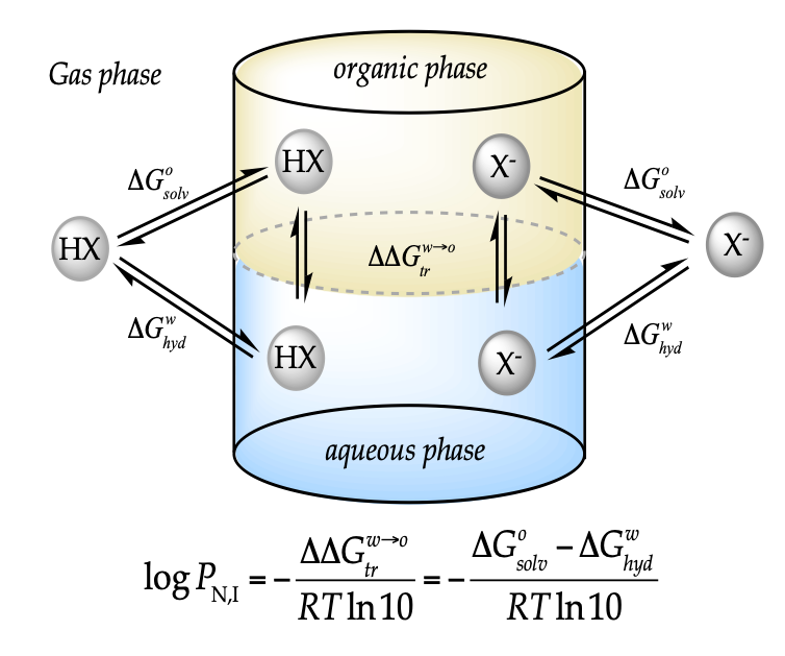
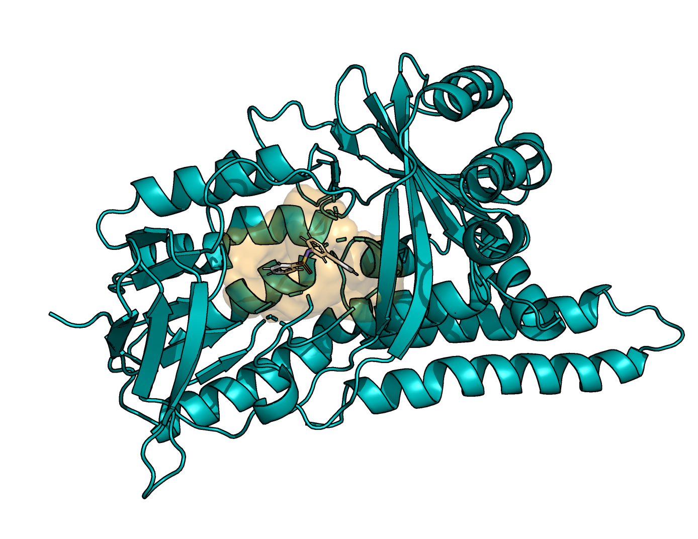
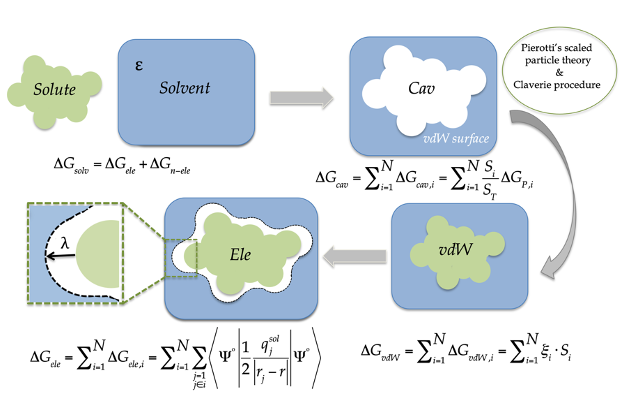
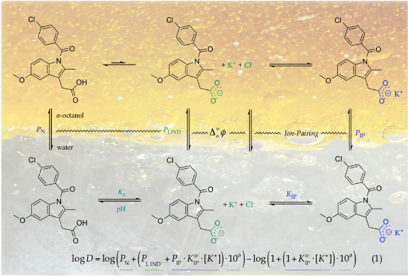
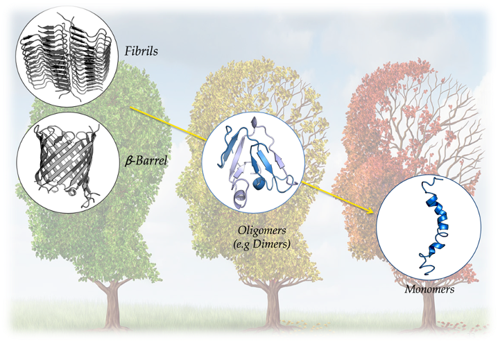
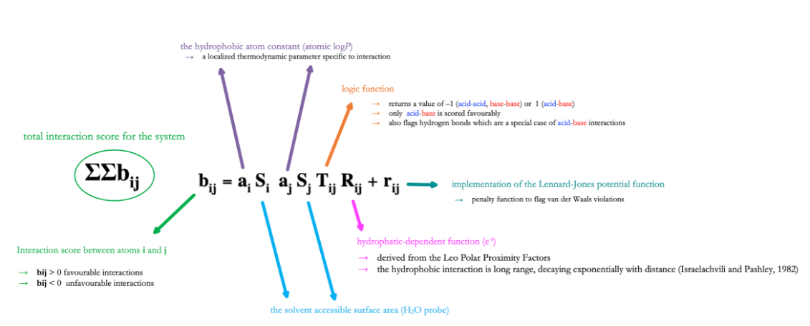
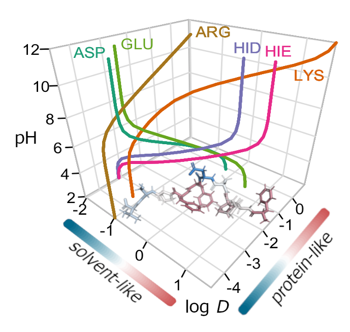
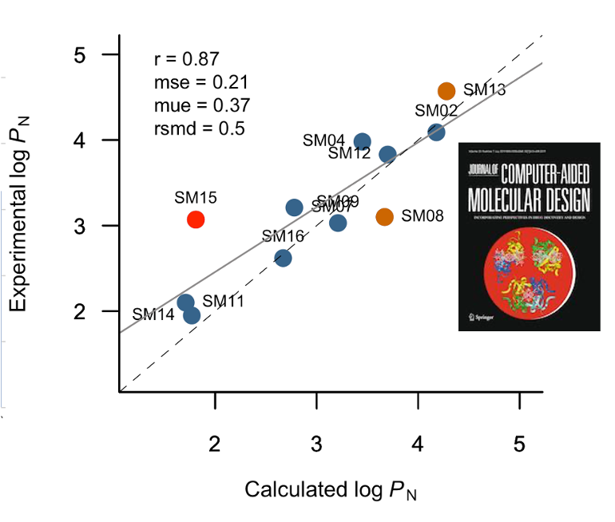
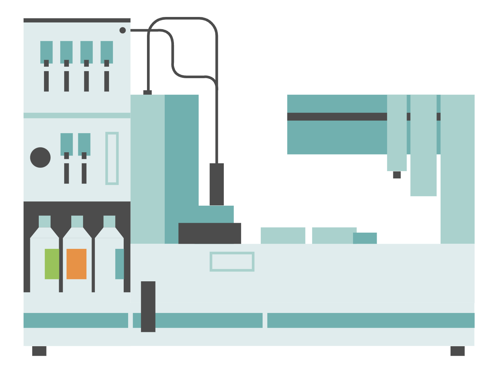

```{r setup, include=FALSE}
knitr::opts_chunk$set(echo = FALSE)
```
<span style="color: blue;">
**Simulation**
</span>

*Drug Design*

Implementation of tools for collaborations in the area of medicinal chemistry in antibiotic development such as use and development of chemoinformatics tools, ADME-Tox properties, docking using Glide, QSAR studies and classical molecular dynamic simulations using AMBER). 

*Computational Biology* 

QSAR studies and classical molecular dynamic simulations in peptides and proteins, mainly AMPs. Prediction of the effect of mutations in diseases such as Alzheimer and Myotonia. Study of peptides with neuroprotective and antioxidant effects. 

*Computational Chemistry* 

Development and parameterization of the continuous solvation model IEFPCM/MST using
Gaussian. Determination of QM-based physicochemical properties in small molecules including drugs and pollutants

<span style="color: blue;">
**Theoretical**
</span>

*Physical chemistry* 

Theoretical models for lipophilicity profiles of ionizable compounds considering the
effect of the pH and background salt. 

Models to explain the relative water content in aerosols as a function of the organic solute present in these colloidal suspensions. 

*Drug Design* 

Development of software and scoring functions for docking studies in collaboration with Phamacelera Inc. 

*Computational Biology* 

Developed a structure-based lipophilicity scale of amino acids, models to describe amphipathicity in antimicrobial peptides-AMPs.

<span style="color: blue;">
**Data Exploration** 
</span>


Development of models based on artificial intelligence for determining physicochemical properties in small molecules including drugs (bioactivity, lipophilicity and tautomeric equilibria) and pollutants (solubility and
toxicity).

<span style="color: blue;">
**Experimental**
</span>


*Drug Design* 

Potentiometric and Shake-flask methods to determine the
pKa and lipophilicity of small molecules. 

*Environmental Pollutants*

Quantification by analytical techniques of emerging pollutants for the creation of databases for computational models.

*Phytotherapeutics* 

Analysis, biological activity, collaborative research in the improvement of bioavailability with the application of nanotechnology. 
Natural Products Research (Structural elucidation methods as NMR, MS, IR)

*Separation methods* 

Column and thin layer chromatography, UPLC, HPLC; Antioxidant methods: Oxygen radical
absorption capacity based on fluorometry -ORAC. 


