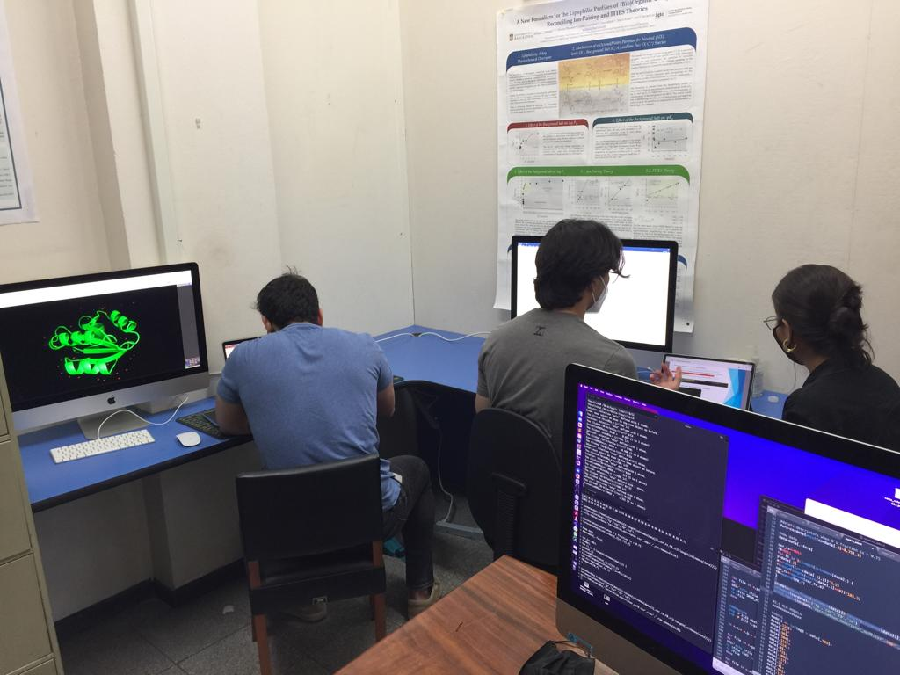
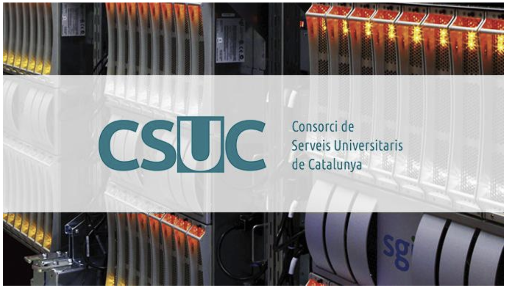
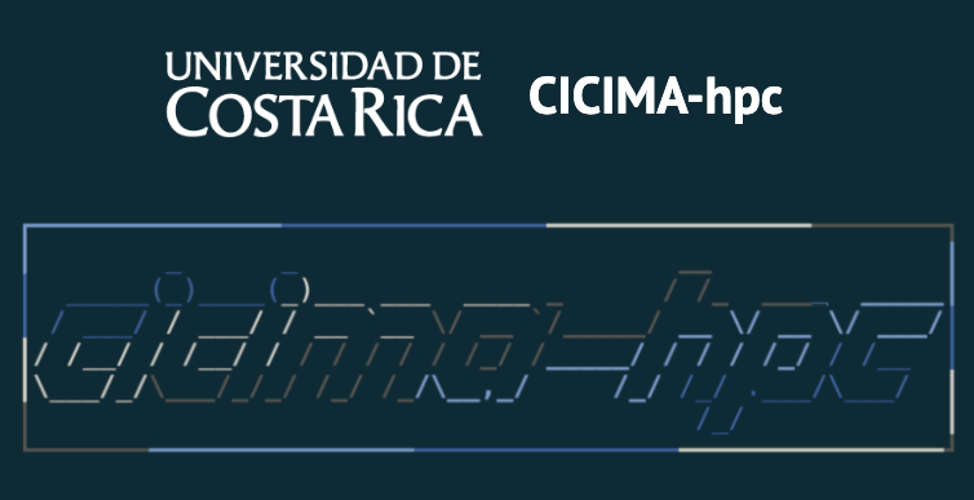
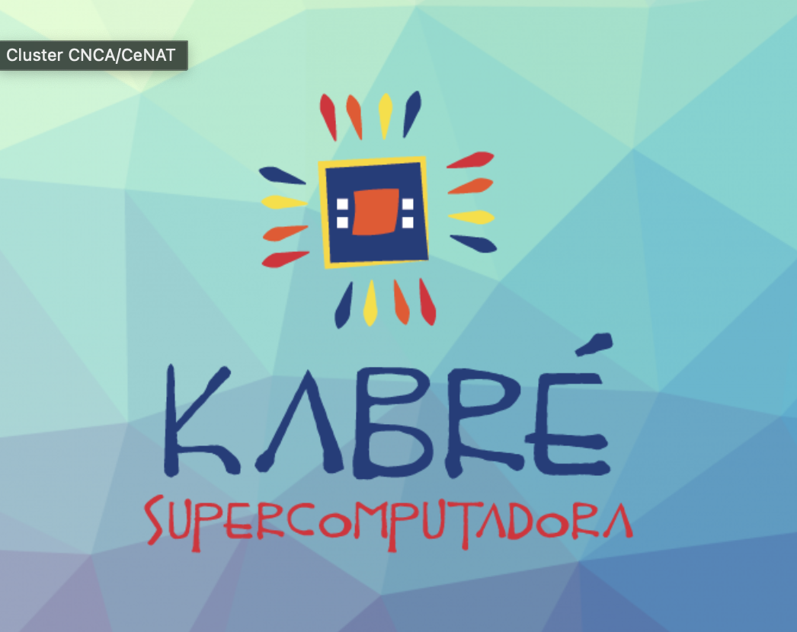

```{r setup, include=FALSE}
knitr::opts_chunk$set(echo = FALSE)
```

1) Our Computer Lab with all the necessary software to carry out research

```{r layout="l-body"}

```

2) Thanks to the projects in collaboration with Dr. Javier Luque (UB), Dr. Antonio Viayna (UB), Dr. Javier Vázquez (Pharmacelera Inc.)  Dr. Cales Curutchet (UB) <http://www.ub.edu/cbcg/index.php>, we have available the use of HPC resources from *Consorci de Serveis Universitaris de Catalunya, CSUC*

```{r layout="l-body"}

```

3) Within the UCR, we have the support of The Computational Cluster of the Materials Science and Engineering Research Center (CICIMA-HPC). For more information contact to: Dr. Federico Muñoz (federico.munozrojas@ucr.ac.cr). As well as the following link:

  <https://sites.google.com/view/cluster-cicima/uso-b%C3%A1sico/acceso-remoto?authuser=0>
  
```{r layout="l-body"}

```

4) We also have the resources of the National High Technology Center, specifically, Advanced Computing Lab (CNCA).For more details:
 <https://kabre.cenat.ac.cr/>
 
```{r layout="l-body"}

```
 
 

