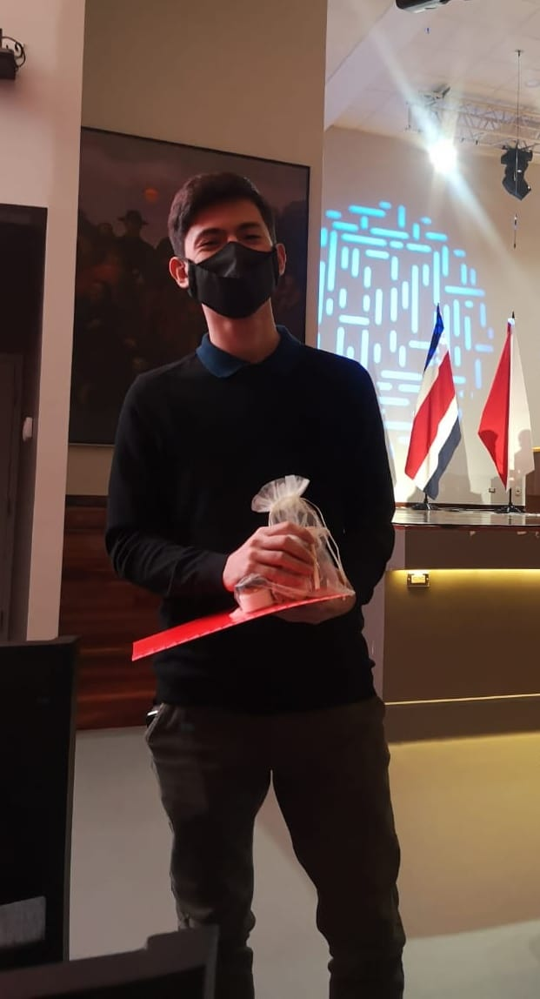

```{r setup, include=FALSE}
knitr::opts_chunk$set(echo = FALSE)
```

**BIO**

Active third year student of a bachelor’s degree in chemistry at UCR. Currently, he is interested in computational chemistry, biochemistry, molecular biology and inorganic chemistry; but outside of chemistry he enjoys math and biology. He has undertaken courses on scientific computation in Python. It is his goal to continue his education with a Master’s and/or PhD overseas. As his pastimes, Sebastian likes to travel with his family, reading, watching anime and play videogames.

**PRIZES AND AWARDS**

1) In 2020, his first year as a University student, he became part of our research group and began to work in the project: Prediction of Physico-Chemical Profiles and Rational Design of Bioactive Compounds Assisted by In Silico Methods.

2) He was the sixth highest grade on the admission exam to the University of Costa Rica in 2019, which awarded him with a scholarship for his studies that he has been able to maintain ever since due to his astounding grades.

3) Gold medal in the category A of the XIII Costarican Biological Sciences Olympiad in 2019.

4) Silver medal in the advanced category of the XIX Costarican Chemistry Olympiad in 2019.

5) Bronze medal in the III Centroamerican and Caribbean Biology Olympiad in 2019.

6) Honorific mention in the intermediate category of the XVIII Costarican Chemistry Olympiad in 2018.
