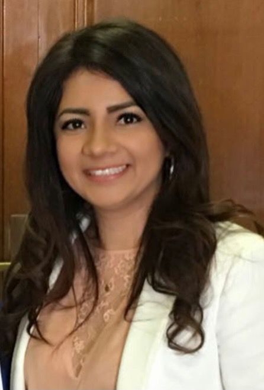

```{r setup, include=FALSE}
knitr::opts_chunk$set(echo = FALSE)
```


**BIO**

Dra. Silvana Pinheiro received two degrees, one in Chemistry (2009) and another in Pharmacy (2010) at the State University of Pará (UFPA) and the Center for University Studies of Pará (Brasil), respectively. Then, at the UFPA, she completed a Master in Science Education in 2010, and joined the research group of Claudio Nahum, where obtained her Master in Genetics and Molecular Biology (Bioinformatics), defended in 2012. In 2013, she was awarded a Ph.D. fellowship from the Ciência Sem Fronteiras program (Programa de Doutorado Pleno) funded by the Conselho Nacional de Desenvolvimento Científico e Tecnológico (CNPq) of Brazil (fellowship 246791/2012-8), to pursue Ph.D. studies at the University of Barcelona under the supervision of Dr. Carles Curutchet.
Her Ph.D., entitled *Study of the impact of electronic polarization in biomolecular interactions*, focused on the investigation of the impact of electronic polarization in intermolecular interactions, both at the ground and excited state, and in biological systems. In 2017, she defended her Ph.D. at the UB.

Dra. Silvana was a Visitor Professor in the Department of Pharmacy and Pharmaceutical Technology and Physical Chemistry - University of Barcelona (02.2019 – 11.2019) and is currently a professor at the Faculty of Pharmacy at the UCR.

**PRIZES AND AWARDS**

1) Research collaboration fellowship funded by the Fundació Bosch i Gimpera of the UB. 

2)	Post-doctoral Junior Fellowship of the Brazilian CNPq (PDJ-CNPq 402036/2017-4) in order to pursue the project entitled "Toward a first-principles prediction of tryptophan fluorescence in proteins", project presented under the supervision of Prof. Nahum (Federal University of Pará) and Prof. Curutchet (University of Barcelona).

3) XIV Trobada d'Història de la Ciència i de la Tècnica, Societat Catalana d'Història de la Ciència i de la Tècnica. Premio al mejor vídeo: Un microscopi virtual per al disseny de fàrmacs. Castellón de la Plana, Spain. Octobre, 2016.

3)	Comas i Solá Competition – University of Barcelona. Vídeo Most Popular: Un
microscopio virtual para el diseño de fármacos. Barcelona, Spain. May, 2016.

4) Concurso de Trabalhos de Conclusão de Curso - TCC. Melhor Trabalho de Conclusão
de Curso – MTCC/UEPa: Subsídios para a História da Química no Pará: O Liceu
Paraense no final do sec. X. (Research for graduation completion), Universidade
Estadual do Pará. Belém-Pará, Brazil, 2012.

5) III Congresso de Assistência Farmacêutica da Amazônia Brasileira. Honorific Mention:Atenção farmacêutica na dispensação de medicamentos para hanseníase em Jacundá- Pa. Belém-Pará, Brazil, 2010.


