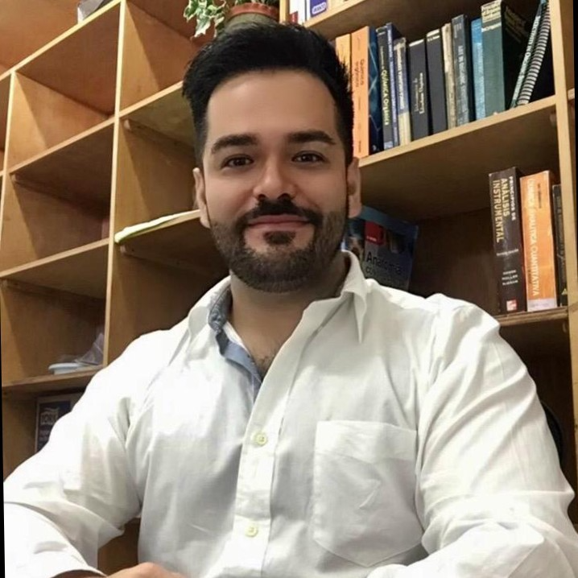

```{r setup, include=FALSE}
knitr::opts_chunk$set(echo = FALSE)
```


**BIO**

I did my Ph.D at the University of Barcelona (UB) in the group of Prof. Javier Luque, where I obtained my doctorate with highest honors. Then, I did a Postdoctorate combining theoretical and experimental methods in computer aided drug design (CADD). I worked in the parametrization of QM-based solvation models, being one of the most accurate methods based on the results of the SAMPL Challenges. Also, I made experimental work for determining lipophilicity in drugs with the Prof. Clara Ràfols.

I was a Visitor Professor at the State University of Pará (UFPA)-Brazil (2017) and University of Barcelona (2021)

I joined the UCR and Advanced Computing National Collaboratory as early-career researcher in 2020 where I formed a research group in CADD and Computational Biology.

I currently work in interdisciplinary projects in collaboration with Experimental and Teoretical Chemists (U. of Barcelona, U. of Nebraska-USA and U. of Costa Rica), Medicinal Chemists (U. of Costa Rica & Seoul National University-Korea), Computer Scientists (TEC & CNCA-CONARE), Biologists (U. of Costa Rica), Structural Biologists (U. of Melbourne) and Microbiologists (U. of Costa Rica) and Companies (Pion Inc-UK, Pharmacelera Inc-Spain) around the world.

Dr. Zamora is currently working at:

1) Professor, School of Chemistry-UCR.
2) Professor, Faculty of Pharmacy-UCR.
3) Professor, Postgraduate Studies System in Biomedical Sciences, School of Medicine-UCR.
4) Professor, Postgraduate Studies System in Chemistry, School of Chemistry-UCR.
5) Associate Researcher, Advanced Computing Laboratory (CNCA), CONARE, Costa Rica National High Technology Center (CeNAT)


**PRIZES AND AWARDS**

1)  First Central American to obtain a 2021 Coimbra Group Universities. European Union, Brussels, Belgium: *"Scholarship Programme for Young Professors and Researchers from Latin American Universities"* 
  <https://www.coimbra-group.eu/scholarships/>

2)  First Latin American to obtain an outstanding participation in The SAMPL7 Physical Property Challenge 2021. Drug Design and Resource Data, University of California San Diego, United States: *"The Most Exact in Silico Method for the Determination of Lipophilicity in the SAMPL7 Global Challenge"* 
  <https://link.springer.com/article/10.1007/s10822-021-00397-3>

3)  First Central American to obtain a 2020 Biophysical Society, Maryland, United States: *"Biophysical Society Travel Award for Early Career Researcher to Recognize Excellence in Biophysics and Promote Greater Interaction Among Biophysicists Throughout the World"* 
  <https://www.biophysics.org/blog/tag/travel-awards>

4)  Honorable Mention Ph.D: "summa cum laude" Title:*"Toward Refined Theoretical Models for the Description of Lipophilicity in Biomolecules"*

5) The Journal of Physical Chemistry Letters. American Chemical Society, United States *“Article selected for ACS Live Slides”*
  <https://pubs.acs.org/doi/10.1021/acs.jpclett.9b00028>
  
6) The European Molecular Biology Organization (EMBO-2018), Heidelberg, Germany.
*“Selected participant for EMBO Course”*
Title: "Integrative modeling of biomolecular interactions".

7) The Journal of Physical Chemistry B. American Chemical Society, United States
*“Article selected for ACS Live Slides”*
  <https://pubs.acs.org/doi/10.1021/acs.jpcb.7b08311>
  
8) 1st Latin American Workshop of Molecular Modeling and Computer Simulation, University of Buenos Aires (UBA) 
*“Participant selected for the MMCS practical course”* 
Title: "Molecular Modeling and Computer Simulation

9) MICITT/CONICIT Government of Costa Rica
*Fellowship for doctoral studies at the University of Barcelona*

10) Rectory of the University of Costa Rica.
*Appointment of a partial time in research*

11) Materials Science Institute (CSIC) Fellow, Sevilla Spain.
*Fellowship to attend the postgraduate course "Determination of structures of real solids: nuclear magnetic resonance technique”*

12) Center for Undergraduate Research Opportunities. University de Georgia, United States “Honor Programme: CURO International Research Symposium”
*Selected participant for Life Sciences Area of the University of Costa Rica*
  <https://curo.uga.edu/symposium/>

